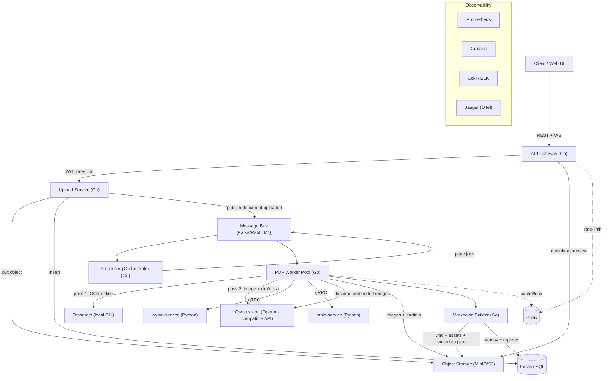
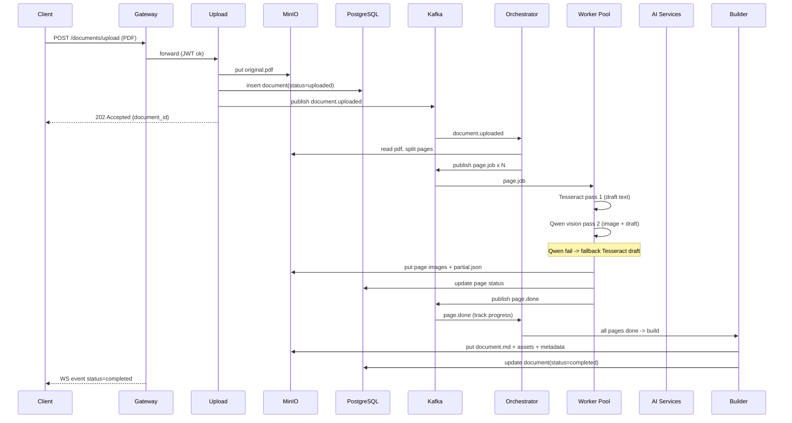
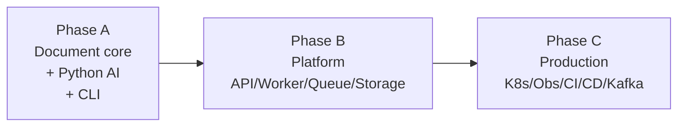
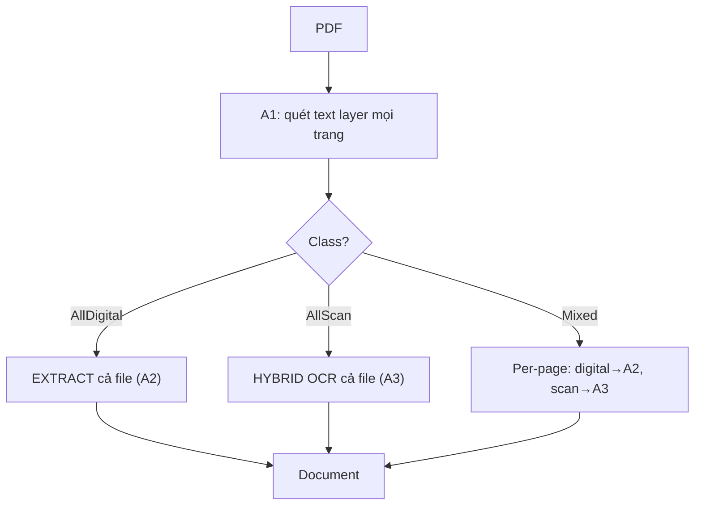
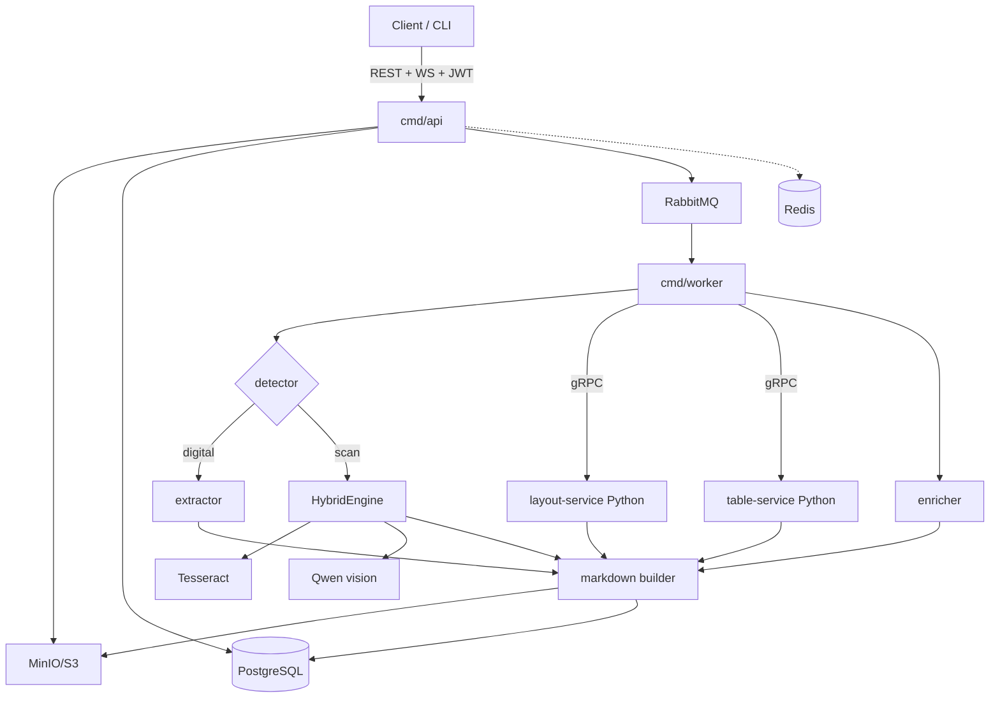
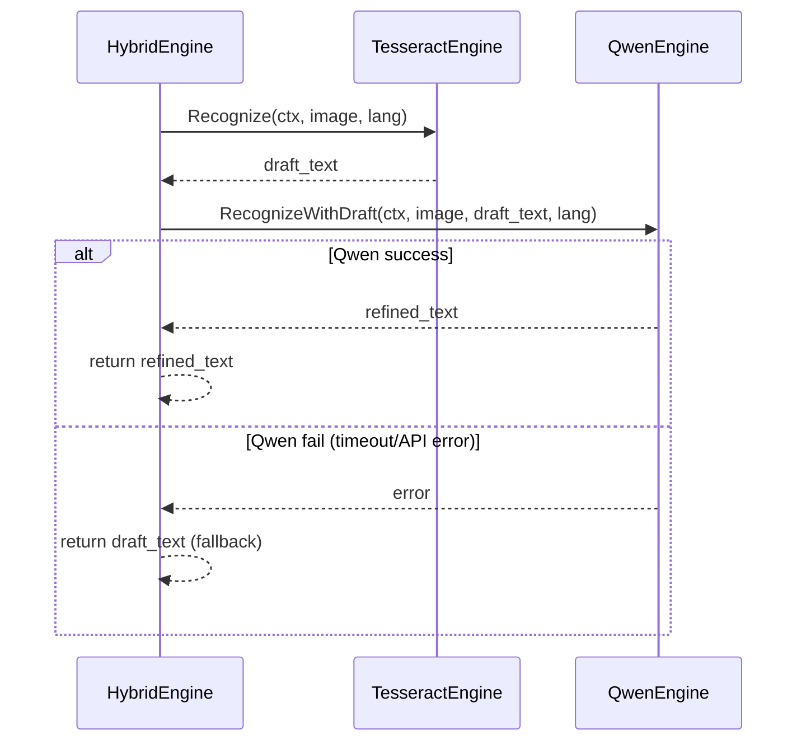

# PDF Intelligence Extraction Platform - Architecture

Nền tảng trích xuất nội dung PDF thành Markdown "sao chép gần 100%" (text, table, image, layout), thiết kế theo kiến trúc microservices, cloud-native, async processing. Tài liệu này là bản thiết kế tổng để xây dựng dần.

> Quy ước: phần diễn giải bằng tiếng Việt; tên service, code, API, identifier dùng tiếng Anh.

> ĐỊNH HƯỚNG ĐÃ CHỐT: build **modular monolith** theo Clean Architecture, triển khai **lần lượt Phase A → B → C** (cả ba đều là phần bắt buộc của project, không phải demo). **Hybrid OCR 2 lượt** (Tesseract → Qwen vision, fallback Tesseract). Tech stack đầy đủ: xem [mục 9](#9-tech-stack) và [mục 12](#12-lộ-trình-triển-khai-phase-a--b--c). Chi tiết OCR: [mục 14](#14-hybrid-ocr-pipeline-tesseract--qwen-vision).

---

## 1. Mục tiêu & phạm vi

Luồng nghiệp vụ cốt lõi:

```
Upload PDF -> Detect (text layer / scan)
  -> Digital PDF: extract text trực tiếp
  -> Scan/image: Hybrid OCR (Tesseract lượt 1 -> Qwen vision lượt 2, fallback Tesseract)
  -> Extract table/image + enrich (LLM mô tả ảnh)
  -> Build Markdown -> Lưu .md + assets + metadata -> Download / Search / Reprocess
```

Yêu cầu chất lượng: file `.md` đầu ra giữ lại tối đa nội dung gốc (thứ tự đọc, heading, đoạn văn, bảng, ảnh đính kèm trong `assets/`).

## 2. Ánh xạ với JD (vì sao kiến trúc này "đúng JD")


| Yêu cầu JD                                           | Thành phần trong hệ thống                                               |
| ---------------------------------------------------- | ----------------------------------------------------------------------- |
| Backend Go, Microservices                            | Gateway, Upload, Orchestrator, Worker, Markdown Builder (Go)            |
| AI Service Integration / AI Gateway                  | OCR/Layout/Table service (Python) sau một AI Gateway, giao tiếp gRPC    |
| Storage subsystem (S3/MinIO)                         | MinIO/S3 lưu PDF gốc, ảnh, `.md`, metadata                              |
| API Gateway throughput cao, scale                    | Gateway + Redis rate-limit + horizontal scaling                         |
| Async processing, scaling                            | Kafka/RabbitMQ + worker pool + K8s HPA                                  |
| RESTful, WebSocket, gRPC                             | REST (client), WebSocket (job status realtime), gRPC (Go <-> Python)    |
| MongoDB/MySQL/PostgreSQL, Redis, Kafka/RabbitMQ/MQTT | PostgreSQL (metadata), Redis (cache/lock/rate-limit), Kafka (event bus) |
| DDD / Clean / Hexagonal                              | Layout `domain / usecase / adapter / delivery`                          |
| Docker, K8s, CI/CD                                   | Dockerfile mỗi service, Helm/K8s manifests, GitHub Actions              |
| Monitoring/Logging (Prometheus/Grafana/Loki/ELK)     | OpenTelemetry + Prometheus + Grafana + Loki                             |
| JWT/OAuth2                                           | Auth ở Gateway                                                          |


> Lưu ý định vị: JD gốc thiên về video/streaming (Media/Device/Alert service). Project PDF này dùng để **chứng minh năng lực kiến trúc tương đương** (async pipeline, AI service tách rời, object storage, microservices, observability). Khi phỏng vấn, nhấn mạnh các "transferable skills" đó.

## 3. Kiến trúc tổng thể (high-level)




## 4. Các service chính

### 4.1 API Gateway (Go)

- Nhiệm vụ: nhận request, xác thực JWT/OAuth2, rate-limit (Redis), routing tới service nội bộ, trả download/preview, đẩy status qua WebSocket.
- Tech: Go + Gin/Fiber/Echo, JWT, Redis.
- API mẫu:
  - `POST /api/v1/documents/upload`
  - `GET  /api/v1/documents/{id}`
  - `GET  /api/v1/documents/{id}/status`
  - `GET  /api/v1/documents/{id}/download` (md)
  - `GET  /api/v1/documents/{id}/preview`
  - `POST /api/v1/documents/{id}/reprocess`
  - `WS   /api/v1/documents/{id}/events` (realtime status)

### 4.2 Upload Service (Go)

- Validate file (magic bytes, size, page count), lưu PDF gốc vào MinIO, tạo record metadata, publish event `document.uploaded`.
- Phase B: gộp vào `cmd/api` hoặc tách binary sau nếu cần scale riêng.

### 4.3 Processing Orchestrator (Go)

- "Bộ điều phối": consume `document.uploaded`, tách PDF thành N page, sinh `page.job` cho từng trang, theo dõi tiến độ, gom kết quả, kích hoạt Markdown Builder khi đủ.
- Thể hiện: concurrency, worker pool, queue, retry, timeout, semaphore, idempotency.

### 4.4 PDF Worker Pool (Go)

- Consume `page.job`. Mỗi page:
  1. **Detect**: PDF số (có text layer) -> trích xuất trực tiếp; PDF scan/ảnh -> đi nhánh Hybrid OCR.
  2. **Render** page -> ảnh (pdftoppm) nếu cần OCR.
  3. **Hybrid OCR** (scan/ảnh):
    - **Pass 1 — Tesseract**: OCR nhanh, offline, tạo *draft text* (bản nháp).
    - **Pass 2 — Qwen vision**: gửi **ảnh trang + draft text**; Qwen sửa lỗi OCR, khôi phục cấu trúc (heading, bảng, đoạn).
    - **Fallback**: nếu Qwen timeout/lỗi/API down -> dùng kết quả Tesseract pass 1.
  4. Gọi **layout-service** (gRPC) phân vùng bbox; **table-service** (gRPC) extract bảng.
  5. **Enricher**: mô tả ảnh nhúng + refine toàn document (Phase A).
  6. Xuất "page partial" (JSON theo `document` model) vào storage/queue.
- Đây chính là nơi **tái sử dụng lõi đã code**: `detector`, `extractor`, `ocr` (TesseractEngine + QwenEngine + HybridEngine), `enricher`, `markdown`, `llm`.

### 4.5 Python AI Services (layout + table) — Phase A

- **layout-service**: ảnh page → bbox regions (Title, Paragraph, Table, Image, Header, Footer, Caption). Tech: FastAPI + PaddleOCR/layout model, expose gRPC.
- **table-service**: vùng bảng → Markdown table. Tech: FastAPI + Camelot/Tabula/PaddleOCR table, expose gRPC.
- Go worker gọi qua `internal/adapter/layoutclient`, `tableclient` (gRPC).
- OCR chính vẫn chạy trong Go (Hybrid Tesseract + Qwen); Python services bổ sung layout/table chuyên sâu.

### 4.6 Markdown Builder (Go)

- Gom page partials theo thứ tự page + bbox, dựng `document.md`, sắp xếp assets, ghi `metadata.json`.
- Output bundle:
  ```
  document.md
  assets/page-1-image-1.png
  assets/page-2-table-1.png
  metadata.json
  ```

## 5. Mô hình xử lý bất đồng bộ (async)




Yêu cầu vận hành: retry + dead-letter queue, idempotent consumer (dedup theo `job_id`), timeout per stage, backpressure, distributed lock (Redis) để tránh xử lý trùng.

## 6. Mô hình dữ liệu (PostgreSQL)

```sql
-- documents: 1 file PDF người dùng upload
CREATE TABLE documents (
    id           UUID PRIMARY KEY,
    user_id      UUID NOT NULL,
    file_name    TEXT NOT NULL,
    file_size    BIGINT NOT NULL,
    page_count   INT,
    status       TEXT NOT NULL,           -- uploaded|processing|completed|failed
    storage_path TEXT NOT NULL,           -- minio key cho PDF gốc
    result_path  TEXT,                    -- minio key cho bundle .md
    error        TEXT,
    created_at   TIMESTAMPTZ NOT NULL DEFAULT now(),
    updated_at   TIMESTAMPTZ NOT NULL DEFAULT now()
);

-- pages: trạng thái xử lý từng trang (theo dõi tiến độ)
CREATE TABLE document_pages (
    id          UUID PRIMARY KEY,
    document_id UUID NOT NULL REFERENCES documents(id),
    page_number INT NOT NULL,
    status      TEXT NOT NULL,            -- pending|processing|done|failed
    partial_path TEXT,                    -- minio key partial.json
    retries     INT NOT NULL DEFAULT 0,
    updated_at  TIMESTAMPTZ NOT NULL DEFAULT now(),
    UNIQUE (document_id, page_number)
);

-- processing_jobs: audit/idempotency cho message
CREATE TABLE processing_jobs (
    id          UUID PRIMARY KEY,
    document_id UUID NOT NULL,
    type        TEXT NOT NULL,            -- split|page|build
    status      TEXT NOT NULL,
    payload     JSONB,
    created_at  TIMESTAMPTZ NOT NULL DEFAULT now()
);
```

## 7. Bố cục Object Storage (MinIO/S3)

```
bucket: pdf-platform
  originals/{document_id}/original.pdf
  pages/{document_id}/page-{n}.png
  partials/{document_id}/page-{n}.json
  results/{document_id}/document.md
  results/{document_id}/assets/...
  results/{document_id}/metadata.json
```

## 8. Cấu trúc thư mục Go (Clean Architecture / DDD)

Monorepo Go đa-binary; mỗi service một entry trong `cmd/`. Lõi xử lý đã code được đưa vào `internal/core`.

```
cmd/
  gateway/        # API Gateway binary
  uploader/       # Upload service
  orchestrator/   # Orchestrator consumer
  worker/         # PDF processing worker
  builder/        # Markdown builder (logic trong worker/converter, Phase A)
  goocr/          # CLI hiện có - chạy toàn pipeline cục bộ (dev/test)

internal/
  domain/                 # Entities + ports (interfaces). KHÔNG phụ thuộc framework
    document/             # Document, Page, Job entities + repository interfaces
    job/

  usecase/                # Application logic (orchestrate domain + ports)
    upload/               # UploadDocument
    process/              # ProcessPage, SplitDocument
    build/                # BuildMarkdown

  core/                   # Lõi xử lý tài liệu (đã code, độc lập transport)
    detector/             # nhận diện loại file + text layer
    extractor/            # pdf/docx extractor
    ocr/                  # ocr.Engine interface + implementations:
                          #   - TesseractEngine (pass 1)
                          #   - QwenEngine (pass 2, vision)
                          #   - HybridEngine (orchestrate + fallback)
    enricher/             # LLM refine + image describe (tách khỏi OCR pass 2 nếu cần)
    markdown/             # renderer
    converter/            # ghép pipeline cục bộ

  adapter/                # Infrastructure (hiện thực các ports)
    repository/postgres/  # documents/pages repo
    storage/minio/        # object storage
    queue/rabbitmq/       # publisher/consumer (giai đoạn 1)
    cache/redis/          # cache/lock/rate-limit
    llm/                  # LLM client OpenAI-compatible (Qwen)  [DONE]
    ocrclient/grpc/       # (legacy) — OCR qua Python nếu cần bổ sung
    layoutclient/grpc/    # client tới layout-service (Phase A)
    tableclient/grpc/     # client tới table-service (Phase A)

  delivery/               # Transport layer
    http/                 # REST handlers (gin/echo)
    grpc/                 # gRPC server/handlers
    ws/                   # WebSocket status push

pkg/
  document/   # shared domain model (Document/Block/...)        [DONE]
  logger/     # slog wrapper
  config/     # config loader (env/yaml)
  errors/     # error types chung

api/
  proto/      # .proto cho gRPC (ocr.proto, ...)
  openapi/    # OpenAPI spec REST

services/
  layout-service/     # Python FastAPI + gRPC — layout/bbox (Phase A)
  table-service/      # Python FastAPI + gRPC — table extraction (Phase A)

deployments/
  docker-compose.yml           # Phase B: pg, redis, rabbit, minio, api, worker, layout, table
  grafana/dashboards/            # Phase C
  loki/                        # Phase C
  k8s/ | helm/                 # Phase C
build/
  package/    # Dockerfile.<service>
  ci/         # github-actions
configs/
scripts/
test/
docs/
```

Nguyên tắc phụ thuộc (Clean Architecture): `delivery -> usecase -> domain`; `adapter` hiện thực interface của `domain`; `domain` không import gì từ `adapter`/`delivery`. Dependency injection ráp ở `cmd/*/main.go`.

> Tái sử dụng: toàn bộ code Phase 1-3 (model `pkg/document`, các interface trong `internal/extractor|ocr|markdown|enricher`, client `internal/llm`) khớp trực tiếp vào `internal/core` + `internal/adapter/llm`. Không bỏ phí.

## 9. Tech stack (áp dụng đầy đủ qua Phase A → B → C)


| Hạng mục                  | Công nghệ                                                  | Phase triển khai        |
| ------------------------- | ---------------------------------------------------------- | ----------------------- |
| Backend / API             | Go + Gin/Fiber/Echo                                        | B                       |
| Worker / orchestration    | Go worker pool                                             | B                       |
| CLI (dev/local)           | Cobra (`cmd/goocr`)                                        | A                       |
| OCR pass 1                | Tesseract (local CLI)                                      | A                       |
| OCR pass 2                | Qwen vision (OpenAI-compatible API)                        | A                       |
| Layout + table (bbox)     | Python FastAPI + PaddleOCR/Camelot                         | A                       |
| RPC nội bộ Go ↔ Python    | gRPC (protobuf)                                            | A                       |
| Message bus               | RabbitMQ                                                   | B                       |
| Message bus (scale)       | Kafka (thay/thêm song song RabbitMQ)                       | C                       |
| Cache / lock / rate-limit | Redis                                                      | B                       |
| Database                  | PostgreSQL                                                 | B                       |
| Object storage            | MinIO / S3                                                 | B                       |
| Auth                      | JWT / OAuth2                                               | B                       |
| Realtime status           | WebSocket                                                  | B                       |
| Retry / DLQ / idempotency | RabbitMQ DLQ + Redis lock                                  | C                       |
| Container                 | Docker (multi-stage)                                       | C                       |
| Orchestration             | Kubernetes + HPA                                           | C                       |
| CI/CD                     | GitHub Actions                                             | C                       |
| Metrics                   | Prometheus + Grafana                                       | C                       |
| Logs                      | Loki (+ Promtail)                                          | C                       |
| Tracing                   | OpenTelemetry + Jaeger                                     | C                       |
| Dev stack local           | docker-compose (PG, Redis, RabbitMQ, MinIO, observability) | B (core), C (obs stack) |


## 10. Triển khai & vận hành

- **Phase B**: `deployments/docker-compose.yml` — PostgreSQL, Redis, RabbitMQ, MinIO; chạy `api` + `worker` + Python layout service local.
- **Phase C**: Dockerfile multi-stage cho `api`, `worker`, Python services; Helm/K8s manifests; HPA scale Worker theo queue lag / CPU.
- Stateful: PostgreSQL, MinIO, RabbitMQ/Kafka, Redis — managed hoặc StatefulSet.
- Scale: tăng Worker replicas (K8s HPA); Python layout/table service scale độc lập.

## 11. Observability & Security (triển khai trong project)


| Thành phần             | Phase | Nội dung                                                       |
| ---------------------- | ----- | -------------------------------------------------------------- |
| Structured logging     | A     | `log/slog`, fields `document_id`, `page`, `ocr_pass`           |
| JWT / OAuth2           | B     | Gateway middleware, protect upload/download                    |
| WebSocket events       | B     | Push status realtime (`uploaded` → `processing` → `completed`) |
| Prometheus metrics     | C     | Job count, latency p95, queue lag, OCR fallback rate           |
| Grafana dashboards     | C     | Dashboard worker/API/queue                                     |
| Loki + Promtail        | C     | Aggregate logs từ api/worker containers                        |
| OpenTelemetry + Jaeger | C     | Trace upload → page job → OCR → build                          |
| mTLS / presigned URL   | C     | Download an toàn từ MinIO                                      |


## 12. Lộ trình triển khai (Phase A → B → C)

Ba phase đều **bắt buộc**, implement lần lượt trong project. Không có mục "demo JD" riêng — toàn bộ tech stack được lên kế hoạch và code dần.




### Phase A — Document processing core (CLI end-to-end)

Mục tiêu: upload PDF qua CLI, ra `.md` + `assets/` đầy đủ (text, table, image, layout). Không cần Docker/K8s.


| #   | Task                                                             | Tech / package                                                  |
| --- | ---------------------------------------------------------------- | --------------------------------------------------------------- |
| A1  | detector — loại file + quét text layer TẤT CẢ trang (AllDigital/AllScan/Mixed) | `internal/core/detector`                          |
| A2  | extractor PDF/DOCX — text + ảnh nhúng                            | `internal/core/extractor/{pdf,docx}`                            |
| A3  | Hybrid OCR — Tesseract → Qwen vision, fallback                   | `internal/core/ocr` (TesseractEngine, QwenEngine, HybridEngine) |
| A4  | Python layout service — bbox, phân vùng Title/Table/Image        | `services/layout-service` (FastAPI), gRPC                       |
| A5  | Python table service — extract bảng → Markdown table             | `services/table-service` (FastAPI/Camelot), gRPC                |
| A6  | Go gRPC client tới Python services                               | `internal/adapter/layoutclient`, `tableclient`                  |
| A7  | enricher — mô tả ảnh nhúng + refine toàn document sau hybrid OCR | `internal/core/enricher` + `internal/llm`                       |
| A8  | markdown renderer + converter (ghép pipeline)                    | `internal/core/markdown`, `converter`                           |
| A9  | CLI `goocr convert` end-to-end                                   | `cmd/goocr`                                                     |
| A10 | Unit/integration tests + `test/testdata`                         | Go test, mock LLM/gRPC                                          |


**Deliverable Phase A**: `goocr convert input.pdf --out ./result` → `result/document.md` + `result/assets/`.

#### A1 — Phân loại digital/scan theo từng trang (xử lý PDF lai)

A1 luôn **quét text layer của TẤT CẢ các trang** rồi phân loại cả file:

| Class | Điều kiện | Cách xử lý ở A2/A3 |
|-------|-----------|--------------------|
| `AllDigital` | mọi trang có text layer | Fast path: EXTRACT cả file (A2), không OCR |
| `AllScan` | không trang nào có text layer | Fast path: HYBRID OCR cả file (A3) |
| `Mixed` | có cả hai loại trang | Per-page routing: trang digital → A2, trang scan → A3, gom theo thứ tự |

Detect luôn ở mức per-page (bắt buộc để biết file đồng nhất hay lẫn lộn); routing gọn khi đồng nhất, chi tiết khi `Mixed`.

```go
type DocClass int // AllDigital | AllScan | Mixed
type PageKind int // PageDigital | PageScan

type Result struct {
    Kind  Kind        // PDF | DOCX | Image (file-level)
    Class DocClass    // tổng hợp sau khi quét hết trang
    Pages []PageKind  // chi tiết từng trang (PDF)
}
```



### Phase B — Platform (modular monolith + async)

Mục tiêu: API upload async, worker xử lý qua queue, lưu MinIO/Postgres, WebSocket status, JWT.


| #   | Task                                        | Tech / package                                                                            |
| --- | ------------------------------------------- | ----------------------------------------------------------------------------------------- |
| B1  | config, logger, errors                      | `pkg/{config,logger,errors}`                                                              |
| B2  | PostgreSQL repository                       | `internal/adapter/repository/postgres`                                                    |
| B3  | MinIO object storage                        | `internal/adapter/storage/minio`                                                          |
| B4  | RabbitMQ publisher/consumer                 | `internal/adapter/queue/rabbitmq`                                                         |
| B5  | Redis cache + rate-limit                    | `internal/adapter/cache/redis`                                                            |
| B6  | usecase: upload, process, build             | `internal/usecase/{upload,process,build}`                                                 |
| B7  | REST API + JWT auth                         | `internal/delivery/http`, `cmd/api`                                                       |
| B8  | WebSocket status events                     | `internal/delivery/ws`                                                                    |
| B9  | API: reprocess, search documents            | `internal/delivery/http`                                                                  |
| B10 | Worker consume queue, chạy pipeline Phase A | `cmd/worker`                                                                              |
| B11 | docker-compose dev stack                    | `deployments/docker-compose.yml` (PG, Redis, RabbitMQ, MinIO, api, worker, layout, table) |
| B12 | OpenAPI spec                                | `api/openapi/`                                                                            |


**Deliverable Phase B**: `POST /documents/upload` → async processing → `WS /documents/{id}/events` → `GET /documents/{id}/download`.

### Phase C — Production-grade (cloud-native + observability)

Mục tiêu: hệ thống chịu tải, quan sát được, deploy K8s, CI/CD tự động.


| #   | Task                                         | Tech / package                                                  |
| --- | -------------------------------------------- | --------------------------------------------------------------- |
| C1  | Retry, DLQ, idempotency, distributed lock    | RabbitMQ DLQ + Redis lock trong worker                          |
| C2  | Kafka (event bus bổ sung/thay thế cho scale) | `internal/adapter/queue/kafka`                                  |
| C3  | Prometheus metrics exporter                  | `/metrics` trên api + worker                                    |
| C4  | Grafana dashboards                           | `deployments/grafana/dashboards/`                               |
| C5  | Loki + Promtail log aggregation              | `deployments/loki/`                                             |
| C6  | OpenTelemetry instrumentation + Jaeger       | OTel SDK trong api/worker                                       |
| C7  | Dockerfile multi-stage                       | `build/package/Dockerfile.{api,worker,layout,table}`            |
| C8  | Kubernetes manifests + HPA                   | `deployments/k8s/` hoặc Helm chart                              |
| C9  | GitHub Actions CI/CD                         | `build/ci/github-actions.yml` (test, build, push image, deploy) |
| C10 | Load test + profiling worker pool            | k6 hoặc vegeta; `pprof`                                         |


**Deliverable Phase C**: deploy lên K8s, scale worker theo queue, monitor trên Grafana, trace trên Jaeger.

### Thứ tự implement (tóm tắt)

```
A1-A3 (detector, extractor, hybrid OCR)
  → A4-A6 (Python layout/table + gRPC)
  → A7-A9 (enricher, markdown, CLI)
  → B1-B12 (platform async)
  → C1-C10 (production)
```

## 13. Kiến trúc runtime (modular monolith)

Quyết định kiến trúc:

1. **Modular monolith** — 1 codebase, nhiều binary (`api`, `worker`, `goocr`); tách microservice sau nếu cần.
2. **RabbitMQ** (Phase B) → **Kafka** (Phase C) khi cần scale event streaming.
3. **Hybrid OCR 2 lượt**: Tesseract (pass 1) → Qwen vision (pass 2, ảnh + draft), fallback Tesseract.
4. **Python AI services** (layout + table) gọi qua gRPC từ Go worker — không optional.
5. Giao diện: **API + CLI** (Phase B); Web UI có thể thêm sau Phase C.

### 13.1 Sơ đồ runtime (sau Phase B)




### 13.2 Luồng per-page (scan/ảnh)

```
page image (PNG)
    |
    v
[Tesseract pass 1] ---> draft_text
    |
    v
[Qwen vision pass 2] ---> image + draft_text -> refined Markdown
    |
    +-- success --> dung ket qua Qwen
    +-- fail --> fallback draft_text Tesseract
    |
    v
[Layout gRPC] ---> bbox regions (Title/Table/Image/...)
[Table gRPC] ---> Markdown tables cho vung table
[Enricher] ---> mo ta anh nhung + refine toan document
    |
    v
[Markdown builder] ---> page partial -> gom thanh document.md
```

### 13.3 Binary & cấu trúc


| Binary                    | Phase | Vai trò                          |
| ------------------------- | ----- | -------------------------------- |
| `cmd/goocr`               | A     | CLI local, dev/test nhanh        |
| `cmd/api`                 | B     | REST + WebSocket + JWT           |
| `cmd/worker`              | B     | Consumer RabbitMQ, chạy pipeline |
| `services/layout-service` | A     | Python FastAPI + gRPC            |
| `services/table-service`  | A     | Python FastAPI + gRPC            |


Tất cả chung `internal/` (domain/usecase/core/adapter/delivery).

## 14. Hybrid OCR Pipeline (Tesseract + Qwen vision)

Thiết kế chi tiết module `internal/ocr` — **chưa implement**, chỉ là spec.

### 14.1 Interface (đã có)

```go
type Engine interface {
    Recognize(ctx context.Context, image []byte, lang string) (string, error)
}
```

Ba implementation:


| Struct            | Vai trò      | Input                             | Output                              |
| ----------------- | ------------ | --------------------------------- | ----------------------------------- |
| `TesseractEngine` | Pass 1       | `image`, `lang`                   | draft text (có thể lỗi OCR)         |
| `QwenEngine`      | Pass 2       | `image` + draft text (qua prompt) | refined text/Markdown               |
| `HybridEngine`    | Orchestrator | `image`, `lang`                   | Qwen result hoặc fallback Tesseract |


`HybridEngine` giữ reference tới `TesseractEngine` + `QwenEngine` (+ `slog.Logger`).

### 14.2 Luồng `HybridEngine.Recognize`




### 14.3 Qwen pass 2 — message shape

Dùng `internal/llm.Message` với vision:

```go
llm.Message{
    Role: llm.RoleUser,
    Text: "Correct the OCR draft below. Output clean Markdown preserving structure (headings, tables, lists). OCR draft:\n" + draft,
    Images: []llm.Image{{Data: image, Format: "png"}},
}
```

System prompt (gợi ý): "You are a document OCR correction assistant. Fix Tesseract errors using the page image. Do not invent content."

### 14.4 Cấu hình & fallback


| Biến / config                              | Mô tả                                       |
| ------------------------------------------ | ------------------------------------------- |
| `TESSERACT_PATH`                           | Đường dẫn `tesseract.exe` (hoặc trong PATH) |
| `OCR_LANG`                                 | Mặc định `eng+vie`                          |
| `LLM_BASE_URL`, `LLM_API_KEY`, `LLM_MODEL` | Qwen API                                    |
| `OCR_USE_HYBRID`                           | `true` (mặc định) / `false` = chỉ Tesseract |
| `OCR_QWEN_TIMEOUT`                         | Timeout pass 2; hết hạn -> fallback         |


Logging (slog): ghi rõ pass nào được dùng (`ocr_pass=tesseract|qwen|qwen_fallback`), để monitor tỉ lệ fallback.

### 14.5 Khi nào bỏ qua Hybrid OCR


| Trường hợp                  | Hành vi                                         |
| --------------------------- | ----------------------------------------------- |
| PDF có text layer (digital) | `extractor/pdf` trích xuất trực tiếp, không OCR |
| `--force-ocr`               | Bắt buộc Hybrid OCR dù có text layer            |
| `--use-llm=false`           | Chỉ Tesseract pass 1                            |
| Qwen API down               | Tự động fallback Tesseract (HybridEngine)       |


### 14.6 Phân tách với `enricher`

- **Pass 2 (QwenEngine)**: sửa OCR + cấu trúc **theo từng trang ảnh** (core accuracy).
- **Enricher (Phase A7)**: mô tả ảnh nhúng, refine toàn document sau hybrid OCR + layout/table — bắt buộc trong pipeline; có thể tắt bằng flag `--use-enricher=false` khi dev/test.

Hai bước dùng cùng Qwen API nhưng **tách interface** để test/mock độc lập.